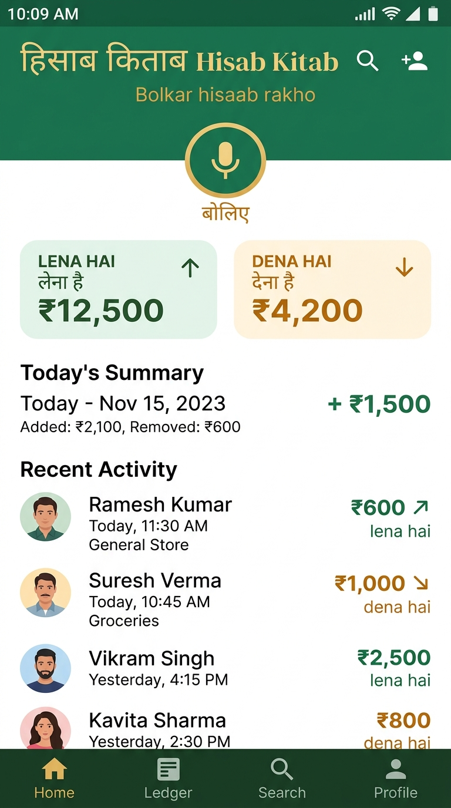
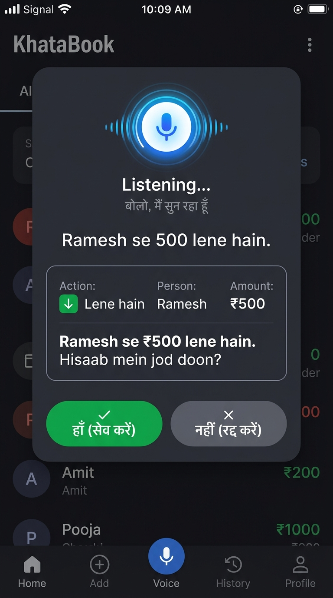
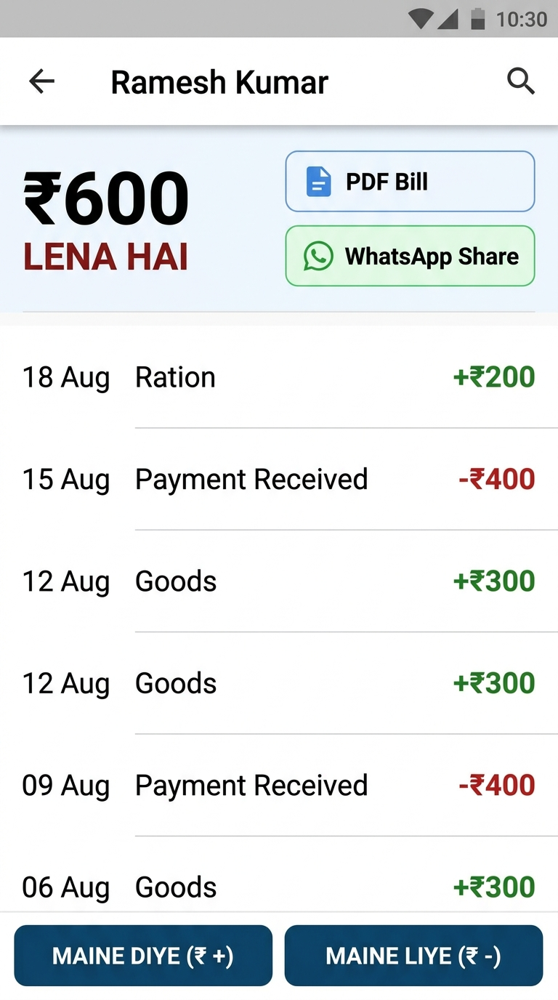

# Hisab Kitab (Digital Bahi-Khata)

> **“Bolkar hisaab rakho.”**

A mobile-first, voice-powered digital Bahi-Khata ledger designed for rural India and small retail shopkeepers. It replaces traditional paper ledgers with a voice-first interface that understands Hindi and Hinglish commands, maintains an immutable double-entry ledger, generates PDF statements, and shares balance summaries via WhatsApp.

---

## 📸 Screenshots & Experience

| 1. Bahi-Khata Dashboard | 2. Bolkar Hisaab (Voice Flow) | 3. Customer Ledger & Statement |
| :---: | :---: | :---: |
|  |  |  |
| **Lena Hai / Dena Hai Balance Overview** | **Natural Voice Parsing & Confirmation** | **Itemized Ledger & WhatsApp Bill Share** |

---

## Key Features

### 1. 🎙️ Voice-First Operation
Shopkeepers can add transactions, check customer balances, and create new ledgers purely using natural spoken Hindi or Hinglish:
* **Add Receivable**: *“Ramesh se 500 lene hain.”*
* **Add Payable**: *“Suresh ko 1000 dene hain.”*
* **Record Payment Received**: *“Ramesh ne 200 de diye.”*
* **Record Goods Description**: *“Ramesh ko 500 ka ration diya.”*
* **Check Balance**: *“Ramesh ka hisaab batao.”* / *“Ramesh se kitna lena hai?”*
* **View Full Ledger**: *“Ramesh ka poora hisaab dikhao.”*
* **Check Store Totals**: *“Abhi total kitna lena hai?”* / *“Aaj ka hisaab batao.”*
* **Reversal / Correction**: *“Ramesh ka 500 wala transaction galat hai.”*
* **Add Customer**: *“Naya customer Ramesh Kumar.”*
* **Generate PDF / WhatsApp**: *“Ramesh ka hisaab PDF bana do.”*

### 2. 🛡️ Confirmation & Clarification Flow
* Every financial transaction prompts for explicit shopkeeper confirmation:
  > *“Ramesh se ₹500 lene hain. Hisaab mein jod doon?”*
  > **Buttons:** [Haan (Save)] | [Nahi (Cancel)]
* If input is ambiguous or missing amount/person, the AI politely asks:
  > *“Thoda aur clearly boliye. Kiska hisaab aur kitne rupaye?”*

### 3. 📒 Immutable Ledger & Audit Trails
* Balances are **always calculated dynamically** from full transaction history (`RECEIVABLE`, `PAYABLE`, `PAYMENT_RECEIVED`, `PAYMENT_MADE`, `ADJUSTMENT`, `REVERSAL`).
* Historical records are **never silently overwritten or deleted**. Wrong transactions create linked reversal entries preserving audit trails.

### 4. 📄 PDF Statements & WhatsApp Sharing
* Download and preview clean, professional customer statement bills formatted in Indian standard currency format (`₹`).
* Instant **Share on WhatsApp** deep-links with pre-composed Hindi/Hinglish summary messages.

### 5. 📱 Mobile-First & Offline-Ready
* Large, legible typography and high-contrast touch targets suitable for active shop counters.
* Local caching for customer rosters and dashboard summaries with online/offline status indicators.

---

## Tech Stack

* **Frontend**: React 19, Tailwind CSS, Lucide Icons, Canvas Confetti, jsPDF
* **Backend**: Node.js / Express, TypeScript, tsx / esbuild
* **Database**: SQLite (via `sql.js` with disk persistence)
* **AI & NLP**: Google Gemini API (`gemini-3.7-flash`) with structured JSON schema intent extraction and offline rule-based fallback
* **Speech**: Web Speech Recognition API & SpeechSynthesis TTS Engine

---

## API Endpoints

| Method | Endpoint | Description |
|---|---|---|
| `POST` | `/api/voice/parse` | Parses Hindi/Hinglish voice transcripts into structured intents with Gemini |
| `GET` | `/api/dashboard` | Returns total *Lena Hai*, *Dena Hai*, today's net summary, and recent customer list |
| `GET` | `/api/people` | Returns list of active customers with computed balances and search filtering |
| `POST` | `/api/people` | Creates a new customer with optional opening balance |
| `GET` | `/api/people/:id` | Returns customer details and current net balance |
| `PUT` | `/api/people/:id` | Updates customer name or phone number |
| `DELETE` | `/api/people/:id` | Archives a customer record |
| `GET` | `/api/people/:id/transactions` | Returns customer ledger filtered by date range or search |
| `POST` | `/api/transactions` | Adds an immutable transaction entry |
| `POST` | `/api/transactions/:id/reverse` | Creates an immutable reversal entry for audit correction |
| `GET` | `/api/people/:id/statement` | Fetches consolidated statement data for PDF/WhatsApp |

---

## Running Locally

1. **Install dependencies**:
   ```bash
   npm install
   ```

2. **Configure Environment Variables**:
   Set `GEMINI_API_KEY` in your `.env` file for AI-powered voice parsing:
   ```env
   GEMINI_API_KEY="your-gemini-api-key"
   ```

3. **Start Development Server**:
   ```bash
   npm run dev
   ```
   The app will run on `http://localhost:3000`.

4. **Build for Production**:
   ```bash
   npm run build
   npm start
   ```
